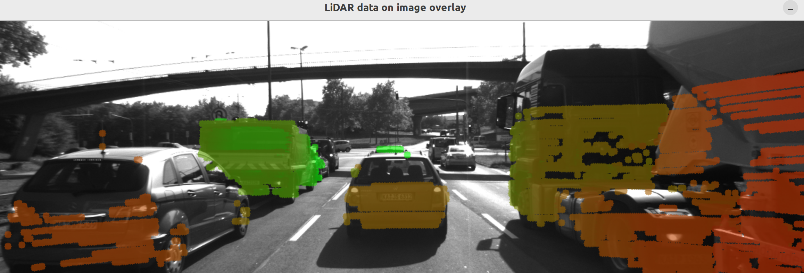

# Sensor Fusion - Computer Vision
## A. List of Topics Seen
1. Lesson 2: Autonomous Vehicles and Computer Vision
   - The OpenCV Library
1. Lesson 3: Engineering a Collision Detection System
   - Estimating TTC with Camera
   - Estimating TTC with Lidar
1. Lesson 4: Tracking Image Features
   - Descriptor Matching
   - Gradient-based vs. Binary Descriptors
   - Haris Corner Detection
   - Intensity Gradient and Filtering
   - Overview of Popular Keypoint Detectors


4. Lesson 6: Combining Camera and Lidar
   - Lidar-to-Camera Point Projection



## B. Dependencies for Local Setup
1. cmake >= 3.22
2. make >= 4.1 (Linux, Mac), 3.81 (Windows)
3. OpenCV >= 4.5
4. c++17


## C. Build Instructions
1. Fork this repo to your Github account
2. Clone your Github repo.
3. Go to the top level directory for an exercise, and run the following commands on your terminal:
```
mkdir build && cd build
cmake ..
make
./<Executable_File_Name>
```
